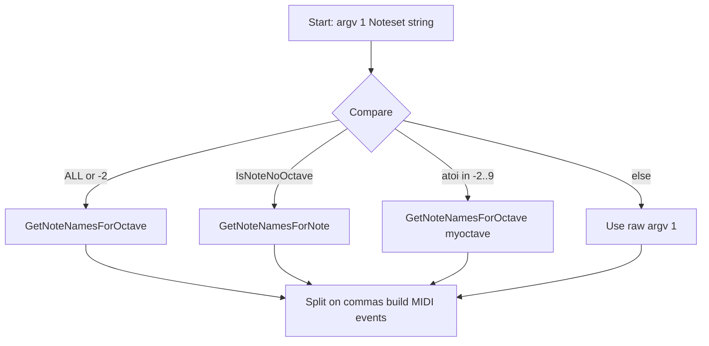

# Command-Line Reference (All Runtime Controls)

This section describes the complete set of runtime command-line controls for the **spimidiminimalmusicgenerator**. In particular, it details the various ways to specify the **Noteset** argument, which determines the pool of MIDI notes the generator will cycle through.

## Invocation

```plaintext
spimidiminimalmusicgenerator.exe [Noteset] [NoteChangePeriod_s] [LoopDuration_s] [MIDIOutputDeviceName] [OutputMIDIChannel] [SimultaneousNotes] [NotesPerChange] [Mode] [ChannelRange]
```

- **Noteset** (argv\[1\]): Defines which notes are available for the pattern.
- **NoteChangePeriod_s** (argv\[2\]): Seconds between note-change events.
- **LoopDuration_s** (argv\[3\]): Total duration of the loop (negative for infinite).
- **MIDIOutputDeviceName** (argv\[4\]): PortMidi device name to open.
- **OutputMIDIChannel** (argv\[5\]): MIDI channel (0–15).
- **SimultaneousNotes** (argv\[6\]): Number of notes sounding at once.
- **NotesPerChange** (argv\[7\]): How many notes to swap each period.
- **Mode** (argv\[8\]): “RANDOM” or “SEQUENTIAL” (default: SEQUENTIAL if not “RANDOM”).
- **ChannelRange** (argv\[9\]): Range of channels (0–16) for random channel assignment.

> Note: For brevity, sibling sections cover defaults and validation rules for all arguments aside from **Noteset**.

---

## Noteset Formats

The **Noteset** parameter supports four mutually exclusive formats. The code in `main.cpp` inspects `argv[1]` and dispatches to the appropriate helper:

```cpp
// in main.cpp
noteset = argv[1];
int myoctave = atoi(noteset.c_str());
if(noteset=="ALL" || noteset=="-2")
{
    noteset = GetNoteNamesForOctave();                // all notes, all octaves
}
else if(IsNoteNoOctave(noteset))
{
    noteset = GetNoteNamesForNote(noteset);            // note-name only, expand across octaves
}
else if(myoctave > -2 && myoctave < 10)
{
    noteset = GetNoteNamesForOctave(myoctave);         // all notes within single octave
}
// later: split `noteset` by commas to build event maps...
```

### 1. Comma-Separated List of Explicit Notes

- **Syntax:** A comma-delimited sequence of note names with octave suffix, e.g.

```plaintext
  C3,D3,E3,F3,G3,A3,B3,C4,D4
```

- **Behavior:** The string is split on commas and each token passed to `GetMidiNoteNumberFromString()`, producing a list of MIDI note numbers.
- **Implementation:**

```cpp
  string notename;
  stringstream stream(noteset);
  while (getline(stream, notename, ','))
  {
      int midinotenumber = GetMidiNoteNumberFromString(notename.c_str());
      // … insert into global_noteonmap/global_noteoffmap …
  }
```

### 2. “ALL” or “-2” Shortcut

- **Syntax:**

```plaintext
  ALL
```

or

```plaintext
  -2
```

- **Behavior:** Expands to **all** chromatic notes across the full supported octave range.
- **Implementation:** Invokes `GetNoteNamesForOctave()` with no arguments, which returns a comma-separated string of every note in every octave.

```cpp
  if (noteset == "ALL" || noteset == "-2")
      noteset = GetNoteNamesForOctave();  // all notes from all octaves
```

### 3. Octave-Only Shortcut

- **Syntax:** A decimal integer between **-2** and **9**, e.g.

```plaintext
  3
  -1
```

- **Behavior:** Selects the entire chromatic set of one octave. For example, “3” yields C3, C#3, …, B3.
- **Implementation:** After parsing `atoi(noteset)`, if the integer lies in the valid range, `GetNoteNamesForOctave(myoctave)` is called.

```cpp
  else if (myoctave > -2 && myoctave < 10)
      noteset = GetNoteNamesForOctave(myoctave);  // all notes in octave myoctave
```

### 4. Note-Name-Only Expansion

- **Syntax:** A single note name without octave, e.g.

```plaintext
  G#
  D
  F
```

- **Behavior:** Expands that note class across all octaves. For example, “C” maps to C–1, C0, …, C9.
- **Implementation:** Detected by `IsNoteNoOctave()`, then routed to `GetNoteNamesForNote(noteset)`.

```cpp
  else if (IsNoteNoOctave(noteset))
      noteset = GetNoteNamesForNote(noteset);  // expand across octaves
```

---

## Under-the-Hood: Noteset Transformation Flow



- **Split & Map:** After resolution, the (possibly expanded) comma-separated string is streamed and split. Each token is converted to a MIDI note number and used to populate the global on/off event maps and the non-playing notes vector.
- **Vectors:** The same list seeds `global_nonplayingnotesvector` and (for SEQUENTIAL mode) `global_sequential_notesvector`.

---

By supporting these four input styles, the tool offers flexible ways to define simple scales, full chromatic sets, or custom patterns with minimal typing.