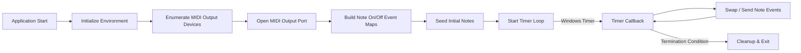
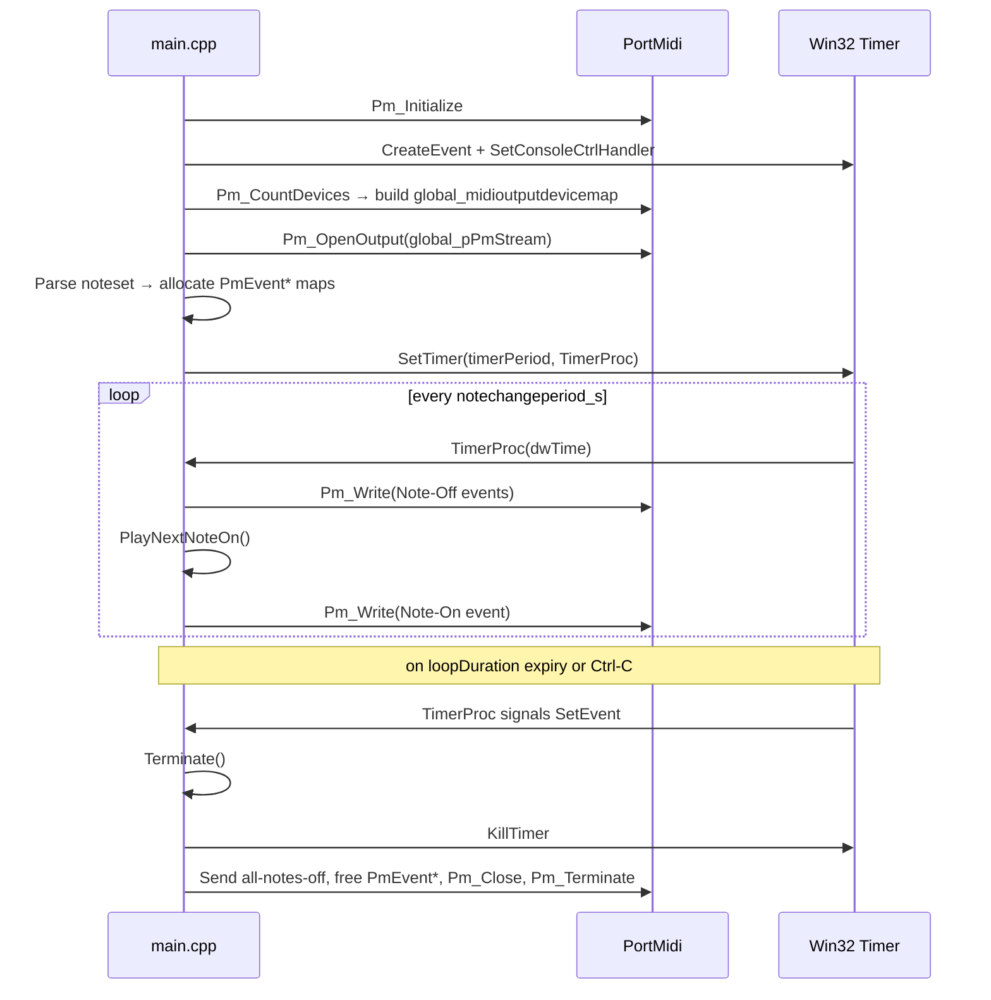

# Developer Notes (Internals: Core Runtime Pipeline)

This section describes the internal runtime lifecycle of the `spimidiminimalmusicgenerator` application, from startup initialization through MIDI port setup, note‐event map construction, timer‐driven playback, and finally graceful shutdown and resource cleanup.

---

## Infrastructure Service Dependencies

The core runtime is implemented as a standalone Windows console application in C++ and does not inject or depend on any external infrastructure services (e.g., message buses, caching layers, background job schedulers, logging frameworks). All interactions occur directly via:

- Win32 APIs (console control handler, timer, event objects)
- PortMidi library (device enumeration, stream open/write/close)
- Standard C++ STL containers for in-memory state

---

## Runtime Lifecycle Overview



---

## 1. Initialization

- Entry point: `main` in **main.cpp**
- Create an auto-reset event (`g_hTerminateEvent`) to signal termination requests.
- Register `ConsoleCtrlHandler` via `SetConsoleCtrlHandler` to catch Ctrl-C / Ctrl-Break.
- Call `Pm_Initialize()` to initialize the PortMidi system.

```cpp
g_hTerminateEvent = CreateEvent(NULL, FALSE, FALSE, NULL);
SetConsoleCtrlHandler(ConsoleCtrlHandler, TRUE);
PmError err = Pm_Initialize();
```

---

## 2. Enumerate and Select MIDI Output Device

- Iterate `i` from `0` to `Pm_CountDevices() - 1`.
- For each `Pm_GetDeviceInfo(i)`, if `info->output` is true, record `info->name` → `i` in `global_midioutputdevicemap`.
- Lookup the user-configured `midioutputdevicename` in that map (default ID 13 if not found).

```cpp
for (int i = 0; i < Pm_CountDevices(); i++) {
    const PmDeviceInfo *info = Pm_GetDeviceInfo(i);
    if (info->output) {
        global_midioutputdevicemap[info->name] = i;
    }
}
auto it = global_midioutputdevicemap.find(midioutputdevicename);
int deviceId = (it != global_midioutputdevicemap.end()) ? it->second : 13;
```

---

## 3. Open MIDI Output Stream

- Call `Pm_OpenOutput(&global_pPmStream, deviceId, NULL, 512, NULL, NULL, 0)` (0 latency).
- On error, print the PortMidi error text and invoke `Terminate()`.

```cpp
err = Pm_OpenOutput(&global_pPmStream, deviceId, NULL, 512, NULL, NULL, 0);
if (err) {
    printf(Pm_GetErrorText(err));
    Terminate();
}
```

---

## 4. Build Note Event Maps

- Parse the comma-separated `noteset` string via `stringstream`.
- For each note name:
- Convert to MIDI note number via `GetMidiNoteNumberFromString(...)`.
- Allocate two `PmEvent*`: one for Note-On (velocity 100), one for Note-Off (velocity 0).
- Insert into `global_noteonmap[midinote]` and `global_noteoffmap[midinote]`.
- Append `midinote` to `global_nonplayingnotesvector` and `global_sequential_notesvector`.

```cpp
while (getline(stream, notename, ',')) {
    int midinote = GetMidiNoteNumberFromString(notename.c_str());
    // Note-On
    PmEvent* on = new PmEvent{0, Pm_Message(0x90+channel, midinote, 100)};
    global_noteonmap[midinote] = on;
    // Note-Off
    PmEvent* off = new PmEvent{0, Pm_Message(0x90+channel, midinote, 0)};
    global_noteoffmap[midinote] = off;
    global_nonplayingnotesvector.push_back(midinote);
    global_sequential_notesvector.push_back(midinote);
}
```

---

## 5. Seed Initial Notes

- Before the timer loop begins, the first `numberofsimultaneousnotes` notes are selected and played:
- In **sequential** mode: `PlayNextNoteOn()` advances an index through `global_sequential_notesvector`.
- In **random** mode: (code‐commented out) would pick a random index from `global_nonplayingnotesvector`.
- Each `PlayNextNoteOn()` call:
- Chooses a MIDI note number.
- Removes it from `global_nonplayingnotesvector`.
- Sends its Note-On `PmEvent*` via `Pm_Write`.

---

## 6. Timer-Driven Message Loop

- Call `SetTimer(NULL, 0, UINT(notechangeperiod_s*1000), TimerProc)` to fire `TimerProc` at each period.
- Store the start tick in `global_dwStartTime_ms` and the total loop duration in `global_loopduration_s`.

### 6.1 TimerProc Callback

```cpp
VOID CALLBACK TimerProc(HWND, UINT, UINT, DWORD dwTime) {
    float elapsed_s = (dwTime - global_dwStartTime_ms) / 1000.0f;
    if (global_loopduration_s > 0.0f && elapsed_s > global_loopduration_s) {
        KillTimer(NULL, global_TimerId);
        SetEvent(g_hTerminateEvent);
        return;
    }
    // Note swap logic:
    // Send Note-Off for old note
    // Remove from playing vector, add back to nonplaying
    // Call PlayNextNoteOn() to send next Note-On
}
```

- Each tick:
- Check if total runtime exceeded; if so, kill the timer and signal termination.
- Turn off the oldest `numberofnotesonchange` playing notes by sending their Note-Off events.
- Invoke `PlayNextNoteOn()` `numberofnotesonchange` times to bring new notes on.

---

## 7. Termination and Cleanup

All cleanup is centralized in `Terminate()`:

1. If `global_TimerId != 0`, call `KillTimer(NULL, global_TimerId)`.
2. Send “all-notes-off” for every MIDI note (0–127) on the selected channel to silence any hanging notes.
3. Iterate `global_noteonmap` and `global_noteoffmap`, delete each `PmEvent*`, then clear the maps and vectors.
4. Call `Pm_Close(global_pPmStream)` to close the PortMidi stream.
5. Call `Pm_Terminate()` to shut down the PortMidi library.
6. Exit the process (return code or ExitProcess).

```cpp
int Terminate() {
    if (global_TimerId) KillTimer(NULL, global_TimerId);
    // All-notes-off flush
    PmEvent evt{0,0};
    for (int note = 0; note < 128; ++note) {
        evt.message = Pm_Message(0x90 + global_outputmidichannel, note, 0);
        Pm_Write(global_pPmStream, &evt, 1);
    }
    // Free allocated events
    for (auto& [note, e] : global_noteonmap) delete e;
    for (auto& [note, e] : global_noteoffmap) delete e;
    global_noteonmap.clear();
    global_noteoffmap.clear();
    global_nonplayingnotesvector.clear();
    global_nowplayingnotesvector.clear();
    // Close and terminate PortMidi
    Pm_Close(global_pPmStream);
    Pm_Terminate();
    return 0;
}
```

---

## Sequence Diagram of Core Playback Flow



---

## Key Global Data Structures

| Name | Type | Purpose |
| --- | --- | --- |
| `global_pPmStream` | `PmStream*` | Active MIDI output stream |
| `global_midioutputdevicemap` | `map<string,int>` | Device name → PortMidi device ID |
| `global_noteonmap` | `map<int,PmEvent*>` | MIDI note → prebuilt Note-On event |
| `global_noteoffmap` | `map<int,PmEvent*>` | MIDI note → prebuilt Note-Off event |
| `global_nonplayingnotesvector` | `vector<int>` | Pool of notes not currently sounding |
| `global_nowplayingnotesvector` | `vector<int>` | Notes currently sounding |
| `global_sequential_notesvector` | `vector<int>` | Ordered noteset for sequential playback |
| `g_hTerminateEvent` | `HANDLE` | Signaled to request application shutdown |
| `global_TimerId` | `UINT` | Windows timer identifier |
| `global_dwStartTime_ms` | `DWORD` | Timestamp when playback loop began |
| `global_loopduration_s` | `float` | Total allowed runtime (seconds) (0 for none) |
| `global_outputmidichannel` | `int` | MIDI channel offset (0–15) |


---

This documentation captures the step-by-step runtime pipeline from application startup through MIDI playback cycles to final cleanup, reflecting the code in **main.cpp** of the `spimidiminimalmusicgenerator_vs2017` project.