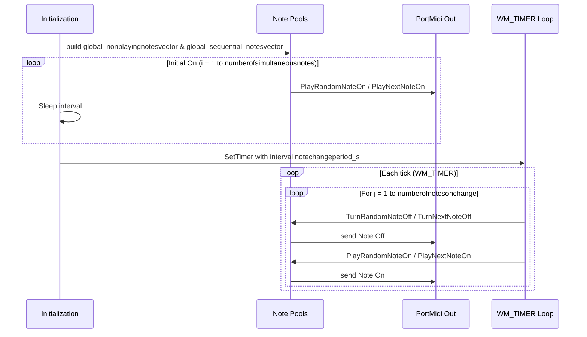

## How to Configure Musical Behavior (Practical Tuning Guide)

This section explains how to control the harmonic density and dynamism of the generated MIDI patterns by tuning two core parameters:

- **numberofsimultaneousnotes**: how many notes are turned on at start
- **numberofnotesonchange**: how many notes are swapped off and on at each timer tick

Adjusting these lets you move from sparse, slowly evolving textures to dense, rapidly shifting harmonies.

### 1. Number of Simultaneous Notes

The parameter `numberofsimultaneousnotes` determines the initial chord size when playback begins. During startup, the application:

1. Populates two vectors:
2. `global_nonplayingnotesvector` (all available notes in the configured set)
3. `global_nowplayingnotesvector` (initially empty)
4. Enters an initialization loop that runs exactly `numberofsimultaneousnotes` times:

```cpp
   for(int i = 0; i < numberofsimultaneousnotes; i++)
   {
       if(global_modestring == "RANDOM")
           PlayRandomNoteOn();
       else
           PlayNextNoteOn();
       Sleep(notechangeperiod_s * 1000);
   }
```

1. Each iteration calls either:
2. `PlayRandomNoteOn()`: picks a note at random from `global_nonplayingnotesvector`, moves it to `global_nowplayingnotesvector`, and sends a Note On via `Pm_Write`.
3. `PlayNextNoteOn()`: takes the next note in sequence from `global_sequential_notesvector`, moves it into `global_nowplayingnotesvector`, and sends a Note On.

Effect on texture:

- **Low** values (e.g., 1–2) yield a sparse, monophonic or thin polyphonic texture.
- **High** values (e.g., 6–8+) create richer, more chordal sounds at the outset.

### 2. Number of Notes per Tick

Once the initial notes are on, the timer is set to fire every `notechangeperiod_s` seconds:

```cpp
global_TimerId = SetTimer(
    NULL, 
    1, 
    (UINT)(notechangeperiod_s * 1000), 
    (TIMERPROC)&TimerProc
);
```

Inside the `WM_TIMER` message handler, the code swaps exactly `numberofnotesonchange` notes each tick:

```cpp
if (Msg.message == WM_TIMER)
{
    for(int i = 0; i < numberofnotesonchange; i++)
    {
        if(global_modestring == "RANDOM")
        {
            TurnRandomNoteOff();
            PlayRandomNoteOn();
        }
        else
        {
            TurnNextNoteOff();
            PlayNextNoteOn();
        }
    }
}
```

- **TurnRandomNoteOff()**: randomly selects one note from `global_nowplayingnotesvector`, sends its Note Off event, and moves it back into `global_nonplayingnotesvector`.
- **TurnNextNoteOff()**: in SEQUENTIAL mode, takes the next note in the ordered list, turns it off, and recycles it.

Effect on dynamism:

- **Low** values (e.g., 1) produce slow, gradual voice leading—only one voice changes per period.
- **High** values (e.g., matching `numberofsimultaneousnotes`) re-voices the entire chord each tick for a highly mobile texture.

### 3. Visualization of the Two Loops



### 4. Practical Tuning Tips

- To **thicken** the initial sound without overwhelming motion, raise `numberofsimultaneousnotes` while keeping `numberofnotesonchange` low.
- To achieve a **drifting cloud** of voices, match both values high so multiple notes swap each tick.
- For **minimalist** output, set both to 1 for a single-voice random walk.
- Always ensure `numberofnotesonchange` ≤ `numberofsimultaneousnotes` to avoid emptying all voices before re-onset.