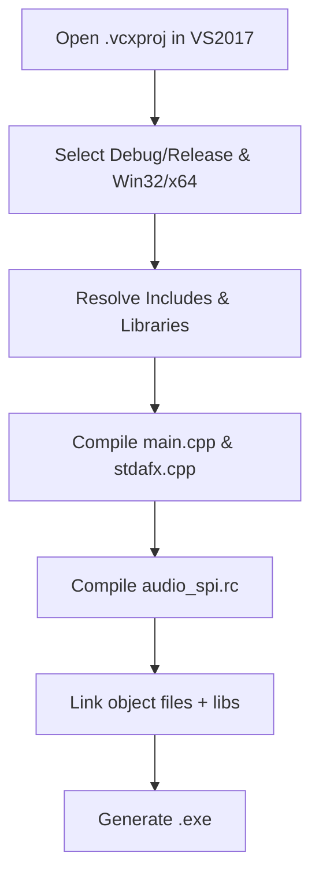

# Install & Build (Windows / Visual Studio 2017+)

This section walks through opening and building the `spimidiminimalmusicgenerator.vcxproj` project directly in Visual Studio 2017 (or later), without relying on a solution (`.sln`) file. You will compile the core source and resource files—`main.cpp`, `stdafx.cpp`, `stdafx.h` and `audio_spi.rc`—to produce the console‐mode MIDI note-pattern generator executable.

---

## 1. Open the Project

1. Launch **Visual Studio 2017** (or newer).
2. From the **File** menu, choose **Open → Project/Solution...**.
3. Navigate to the repository folder and select **spimidiminimalmusicgenerator.vcxproj**.
4. Click **Open**.

Visual Studio will load the project and display it in **Solution Explorer**.

---

## 2. Select Configuration & Platform

In the toolbar at the top:

- **Configuration**: choose **Debug** or **Release**
- **Platform**: choose **Win32** or **x64**

The project defines four configurations:

• Debug | Win32

• Debug | x64

• Release | Win32

• Release | x64

---

## 3. Project Structure & Compiled Files

The `.vcxproj` and accompanying `.vcxproj.filters` specify exactly which files get compiled and how they are organized:

```xml
<ItemGroup>
  <ClCompile Include="main.cpp" />
  <ClCompile Include="stdafx.cpp" />
</ItemGroup>
<ItemGroup>
  <ClInclude  Include="stdafx.h" />
</ItemGroup>
<ItemGroup>
  <ResourceCompile Include="audio_spi.rc" />
</ItemGroup>
```

• **main.cpp** and **stdafx.cpp** compile as C++ source

• **stdafx.h** is included as the precompiled-header header

• **audio_spi.rc** defines the application icon and other Win32 resources

The `.vcxproj.filters` file assigns each to:

- **Source Files** (`.cpp`)
- **Header Files** (`.h`)
- **Resource Files** (`.rc`)

---

## 4. Build the Executable

1. With your desired Configuration/Platform selected, go to the **Build** menu.
2. Click **Build spimidiminimalmusicgenerator** (or press **Ctrl+Shift+B**).
3. Monitor the **Output** window for any compile/link errors.

Upon successful build, the `.exe` will be placed in the project’s output directory:

```plaintext
<ProjectFolder>\$(Configuration)\$(Platform)\spimidiminimalmusicgenerator.exe
```

---

## 5. Build Process Flow



---

## 6. Common Build Issues

- **Missing Include Paths**: Ensure `..\lib-src\portmidi\pm_common`, `..\spiwavsetlib`, and `..\lib-src\portaudio\include` are reachable as defined under `<AdditionalIncludeDirectories>` in each configuration.
- **Unresolved Symbols**: Verify that the PortMidi, PortAudio and `spiwavsetlib` libraries are built for the matching Platform (Win32 vs. x64) and that the `<AdditionalDependencies>` entries in the `.vcxproj` point to the correct `.lib` files.
- **Resource Errors**: If the icon resource fails, confirm that `audio_spi.ico` resides alongside `audio_spi.rc` and that the resource ID `IDI_MAIN_ICON` is defined in **resource.h**.

Once built, run the generated executable from a console window to enumerate MIDI output devices and begin MIDI note-pattern playback.