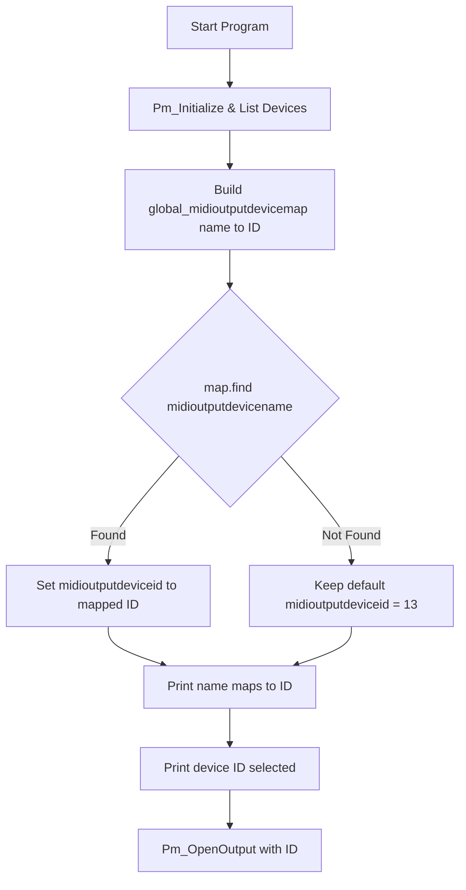

# MIDI Output Setup & Integration Guides (End-User)

This guide explains how the application discovers, selects, and opens a MIDI output device on Windows. You’ll learn how to choose the correct device name, understand the internal name-to-ID mapping, and troubleshoot common mismatches.

## Device Enumeration

When the program starts, it initializes PortMidi and prints all available MIDI **output** devices to the console:

```text
MIDI output devices:
0: Microsoft GS Wavetable Synth, Microsoft GS Wavetable Synth
1: LoopBe Internal MIDI, LoopBe Internal MIDI
2: Out To MIDI Yoke:  1, Out To MIDI Yoke:  1
…
```

- **Index**: The first number (`0`, `1`, `2`, …) is the PortMidi device ID.
- **Interface**: The first string after the colon (`Microsoft GS Wavetable Synth`) is the device interface.
- **Name**: The second string (identical in this example) is the human-readable device name.

The program builds an internal `std::map<std::string,int> global_midioutputdevicemap` by inserting each device’s **name** as the key and its PortMidi ID as the value.

## Specifying a Device by Name

By default, the application uses a hard-coded device name:

```cpp
string midioutputdevicename = "Out To MIDI Yoke:  1";
```

You can override it on the command line as the **fifth** argument:

```plaintext
spimidiminimalmusicgenerator_vs2017.exe <noteset> <period_s> <loop_s> "<device name>" <channel> <simultaneous> <changeCount> <mode> <channelRange>
```

Example:

```plaintext
spimidiminimalmusicgenerator_vs2017.exe C4,C5 0.5 60 "Microsoft GS Wavetable Synth" 0 2 1 RANDOM 16
```

## How Name Matching Works

1. **Default ID** is set to 13:

```cpp
   int midioutputdeviceid = 13;
```

1. The program looks up your specified name:

```cpp
   auto it = global_midioutputdevicemap.find(midioutputdevicename);
   if (it != global_midioutputdevicemap.end()) {
       midioutputdeviceid = it->second;
       printf("%s maps to %d\n", midioutputdevicename.c_str(), midioutputdeviceid);
   }
```

1. If found, it prints:

```plaintext
   Microsoft GS Wavetable Synth maps to 0
```

1. Otherwise, it silently keeps the default ID (13).
2. Finally, it reports:

```plaintext
   device 0 selected      ← when found
   device 13 selected     ← when not found
```

1. It then calls:

```cpp
   Pm_OpenOutput(&global_pPmStream, midioutputdeviceid, NULL, 512, NULL, NULL, 0);
```



## Fallback Behavior

- **Default slot (13)**: If your name doesn’t match exactly, the program still proceeds but opens device 13.
- There is **no warning** beyond the final “device 13 selected” line—no error is thrown.
- If device 13 is invalid or unavailable, PortMidi returns an error and the program terminates.

## Troubleshooting Name Mismatches

1. **Copy Exactly**
2. Select and copy the entire **Name** field from the enumeration output, including spaces and punctuation.
3. Enclose it in quotes when passing it as a command-line argument.

1. **Watch for Extra Spaces**
2. Some drivers include leading/trailing spaces or double spaces (e.g., `"Out To MIDI Yoke:␣␣1"`).
3. Verify by re-running the program and pasting the name into a text editor to confirm every character.

1. **Case Sensitivity & Special Characters**
2. Matching is **case-sensitive**.
3. If the name contains non-ASCII or locale-specific characters, ensure your console encoding matches.

1. **Verify Mapping**
2. After starting, look for the line:

```plaintext
     <Your Device Name> maps to <N>
```

- If you don’t see it, the name wasn’t found—check spacing and spelling.

1. **Alternate Approach**
2. If you continue to have trouble, note the printed **Index** (e.g., `2`) and:
3. Temporarily modify the default in code (`int midioutputdeviceid = 2;`)
4. Or rebuild with a different default slot.

```card
{
    "title": "Tip",
    "content": "Run the program without arguments first to see the exact device list. Then copy-paste the name into your command."
}
```

---

By following these steps, you can reliably select your preferred MIDI output device and avoid falling back to the wrong port.