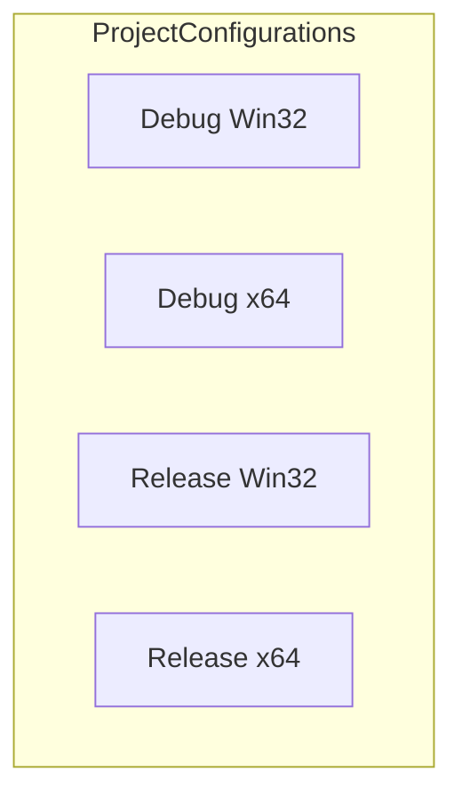

# Project Files & Packaging (Visual Studio specifics)

## Overview

This section describes how the Visual Studio 2017 solution for *spimidiminimalmusicgenerator* is configured and packaged. It covers the project’s supported build configurations (Debug/Release, Win32/x64), global and per-configuration properties, preprocessor defines, include paths, and linker dependencies. Understanding these settings is essential for customizing build options, resolving external library links (PortMidi, PortAudio, spiwavsetlib, winmm), and ensuring the project builds correctly on different platforms.

## Configuration Matrix



The `<ItemGroup Label="ProjectConfigurations">` in `spimidiminimalmusicgenerator.vcxproj` defines four build targets: Debug|Win32, Debug|x64, Release|Win32, and Release|x64 .

## Global Properties

In the top‐level `<PropertyGroup Label="Globals">`, the project sets identifiers and platform versions:

- ProjectGuid: `{F28553CF-E2B6-4124-8F8D-13E4188B2B76}`
- RootNamespace: `spimidiminimalmusicgenerator`
- WindowsTargetPlatformVersion: `10.0.19041.0`
- Keyword: `Win32Proj`

## Common Import & Toolset

All configurations import the default C++ props and target v141:

```xml
<Import Project="$(VCTargetsPath)\Microsoft.Cpp.Default.props" />
...
<PlatformToolset>v141</PlatformToolset>
...
<Import Project="$(VCTargetsPath)\Microsoft.Cpp.targets" />
```

## Per-Configuration Properties

Each build configuration defines core properties:

| Configuration | UseDebugLibraries | WholeProgramOptimization | CharacterSet | PlatformToolset |
| --- | --- | --- | --- | --- |
| Debug Win32 | true | (n/a) | Unicode | v141 |
| Debug x64 | true | (n/a) | Unicode | v141 |
| Release Win32 | false | true | Unicode | v141 |
| Release x64 | false | true | Unicode | v141 |


These appear in `<PropertyGroup Condition="'$(Configuration)|$(Platform)'=='…'">` .

## Preprocessor Definitions & Include Directories

Under each `<ItemDefinitionGroup>`, the `<ClCompile>` section sets defines and include paths:

| Configuration | PreprocessorDefinitions | AdditionalIncludeDirectories |
| --- | --- | --- |
| Debug Win32 | WIN32;_DEBUG;_CONSOLE;%(PreprocessorDefinitions) | .\;..\lib-src\portmidi\pm_common;..\spiwavsetlib;..\lib-src\portaudio\include;%(AdditionalIncludeDirectories) |
| Debug x64 | _WIN64;WIN32;_DEBUG;_CONSOLE;%(PreprocessorDefinitions) | .\;..\lib-src\portmidi\pm_common;..\spiwavsetlib;..\lib-src\portaudio\include;%(AdditionalIncludeDirectories) |
| Release Win32 | WIN32;NDEBUG;_CONSOLE;%(PreprocessorDefinitions) | .\;..\lib-src\portmidi\pm_common;..\spiwavsetlib;..\lib-src\portaudio\include;%(AdditionalIncludeDirectories) |
| Release x64 | _WIN64;WIN32;NDEBUG;_CONSOLE;%(PreprocessorDefinitions) | .\;..\lib-src\portmidi\pm_common;..\spiwavsetlib;..\lib-src\portaudio\include;%(AdditionalIncludeDirectories) |


These settings ensure the compiler sees PortMidi headers in `..\lib-src\portmidi\pm_common`, PortAudio headers, and the local `spiwavsetlib` include folder  .

## Linker Settings

The `<Link>` section in each `<ItemDefinitionGroup>` configures subsystem, debug info, libraries, and ignored defaults:

| Configuration | SubSystem | GenerateDebugInformation | Optimizations | AdditionalDependencies | IgnoreSpecificDefaultLibraries |
| --- | --- | --- | --- | --- | --- |
| Debug Win32 | Console | true | (none) | kernel32.lib;user32.lib;gdi32.lib;winspool.lib;shell32.lib;ole32.lib;oleaut32.lib;uuid.lib;comdlg32.lib;advapi32.lib;..\lib-src\portmidi\release\portmidi_s.lib;winmm.lib;..\spiwavsetlib_vs2017u\debug\spiwavsetlib_vs2017.lib;..\lib-src\portaudio\build\msvc\Win32\Debug\portaudio_x86.lib | libcmtd.lib |
| Debug x64 | Console | true | (none) | kernel32.lib;user32.lib;gdi32.lib;winspool.lib;shell32.lib;ole32.lib;oleaut32.lib;uuid.lib;comdlg32.lib;advapi32.lib;..\lib-src\portmidi\release\portmidi_s.lib;winmm.lib;..\spiwavsetlib_vs2017u\x64\release\spiwavsetlib_vs2017.lib;..\lib-src\portaudio\build\msvc\Win32\Debug\portaudio_x86.lib | libcmtd.lib |
| Release Win32 | Console | true | EnableCOMDATFolding, OptimizeReferences | kernel32.lib;user32.lib;gdi32.lib;winspool.lib;shell32.lib;ole32.lib;oleaut32.lib;uuid.lib;comdlg32.lib;advapi32.lib;..\lib-src\portmidi\Release\portmidi_s.lib;winmm.lib;..\spiwavsetlib_vs2017u\release\spiwavsetlib_vs2017.lib;..\lib-src\portaudio\build\msvc\Win32\Release\portaudio_x86.lib | libcmt.lib |
| Release x64 | Console | true | EnableCOMDATFolding, OptimizeReferences | kernel32.lib;user32.lib;gdi32.lib;winspool.lib;shell32.lib;ole32.lib;oleaut32.lib;uuid.lib;comdlg32.lib;advapi32.lib;..\lib-src\portmidi(x64)\x64\Release\portmidi-dynamic.lib;winmm.lib;..\spiwavsetlib_vs2017u\x64\release\spiwavsetlib_vs2017.lib;..\lib-src\portaudio(x64)\build\msvc\x64\Release\portaudio_x64.lib | libcmt.lib |


These linker dependencies pull in:

- Windows system libraries (`kernel32.lib`, `user32.lib`, `winmm.lib`, etc.),
- The static PortMidi library (`portmidi_s.lib`),
- The custom `spiwavsetlib` library,
- PortAudio (`portaudio_x86.lib` for Win32, `portaudio_x64.lib` for x64),
- And ignore the CRT default libraries (`libcmtd.lib` in Debug, `libcmt.lib` in Release) to avoid conflicts  .

## Filters File

The `.vcxproj.filters` file organizes project items into IDE filters:

- **Source Files**: `.cpp`, `.c`, `.cc`, `.cxx`, etc.
- **Header Files**: `.h`, `.hpp`, `.inl`, etc.
- **Resource Files**: `.rc`, `.ico`, `.wav`, etc.
- Maps `main.cpp` and `stdafx.cpp` under Source, `stdafx.h` under Header, and `audio_spi.rc` under Resource .

---

Understanding and modifying these settings in `spimidiminimalmusicgenerator.vcxproj` enables you to tailor the build process—add new include paths, adjust preprocessor flags, swap library versions, or target different platform toolsets—ensuring seamless integration of PortMidi, PortAudio, and the custom `spiwavsetlib` across Debug/Release and 32-/64-bit builds.