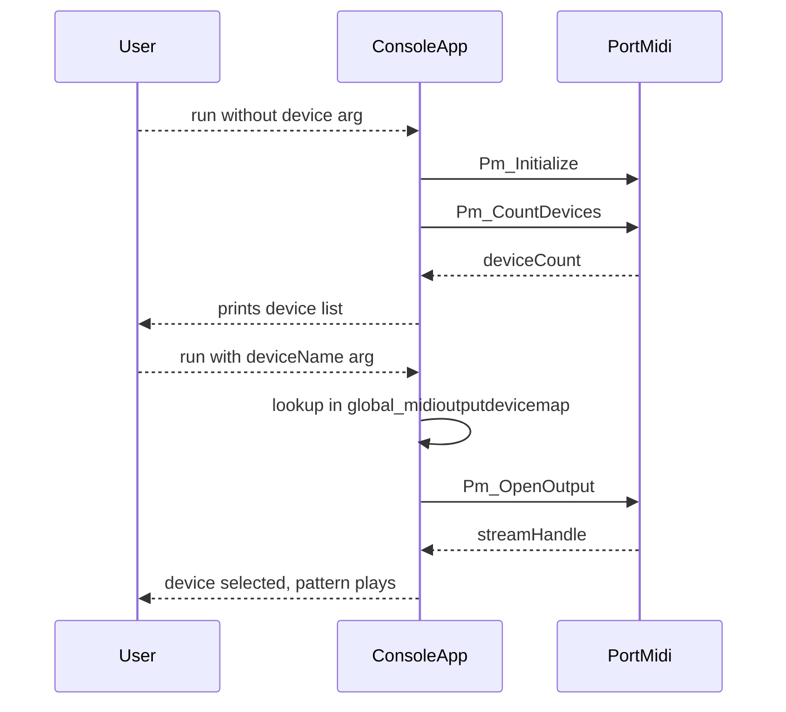

# Quick Start: Generate MIDI Minimal-Music Patterns

## First Run: Enumerate MIDI Outputs and Choose a Target Device

This section walks you through the “first sound” workflow. You’ll run the console application to list available MIDI output devices, note the desired device name, and then re-run the app passing that name as the 4th command-line argument. Internally, the program builds a map from device names to IDs and uses PortMidi’s `Pm_OpenOutput` to open the chosen device.

### Prerequisites

- Build the project in Visual Studio 2017 (v141) or via MSBuild.
- Ensure PortMidi is installed and its libraries are linked (see the `.vcxproj` for details).
- Connect or install at least one MIDI output device (e.g., Microsoft GS Wavetable Synth, MIDI Yoke).

### 1. Run without specifying a device

Open a console and execute the app with at least three arguments:

```plaintext
spimidiminimalmusicgenerator.exe "C3,D3,E3,F3,G3" 2.0 300.0
```

- `"C3,D3,E3,F3,G3"` – comma-separated note names
- `2.0` – note-change period in seconds
- `300.0` – total loop duration in seconds

On startup, the app initializes PortMidi and prints all available MIDI output devices:

```cpp
Pm_Initialize();
cout << "MIDI output devices:" << endl;
for (int i = 0; i < Pm_CountDevices(); i++) {
    const PmDeviceInfo *info = Pm_GetDeviceInfo(i);
    if (info->output) {
        printf("%d: %s, %s\n", i, info->interf, info->name);
        global_midioutputdevicemap.insert(pair<string,int>(info->name, i));
    }
}
```

You’ll see output similar to:

```plaintext
MIDI output devices:
0: Microsoft, Default MIDI Device
1: Microsoft, GS Wavetable Synth
13: MIDI Yoke, Out To MIDI Yoke:  1
…
```

### 2. Re-run with your chosen device name

Note the exact device name from the list (for example, `Out To MIDI Yoke:  1`) and re-execute, passing it as the 4th argument:

```plaintext
spimidiminimalmusicgenerator.exe "C3,D3,E3,F3,G3" 2.0 300.0 "Out To MIDI Yoke:  1"
```

Internally, the code maps that name to its integer ID and opens the output stream:

```cpp
string midioutputdevicename = argv[4];  // e.g. "Out To MIDI Yoke:  1"
int midioutputdeviceid = 13;            // default if name not found
auto it = global_midioutputdevicemap.find(midioutputdevicename);
if (it != global_midioutputdevicemap.end()) {
    midioutputdeviceid = it->second;
    printf("%s maps to %d\n", midioutputdevicename.c_str(), midioutputdeviceid);
}
cout << "device " << midioutputdeviceid << " selected" << endl;

Pm_Error err = Pm_OpenOutput(
    &global_pPmStream,
    midioutputdeviceid,
    NULL,      // no extra driver info
    512,       // buffer size
    NULL, NULL,
    0          // zero latency
);
if (err) {
    printf(Pm_GetErrorText(err));
    Terminate();
}
```

On success, you’ll hear the minimal-music pattern playing through your selected device.

### 3. Operation Sequence



- **Pm_Initialize**: sets up PortMidi
- **Pm_CountDevices / Pm_GetDeviceInfo**: enumerates devices and builds `global_midioutputdevicemap`
- **Pm_OpenOutput**: opens the selected MIDI output stream (`global_pPmStream`)

### Default Behavior

If you omit the 4th argument, the program uses

```cpp
string midioutputdevicename = "Out To MIDI Yoke:  1";
```

as the default target device name.