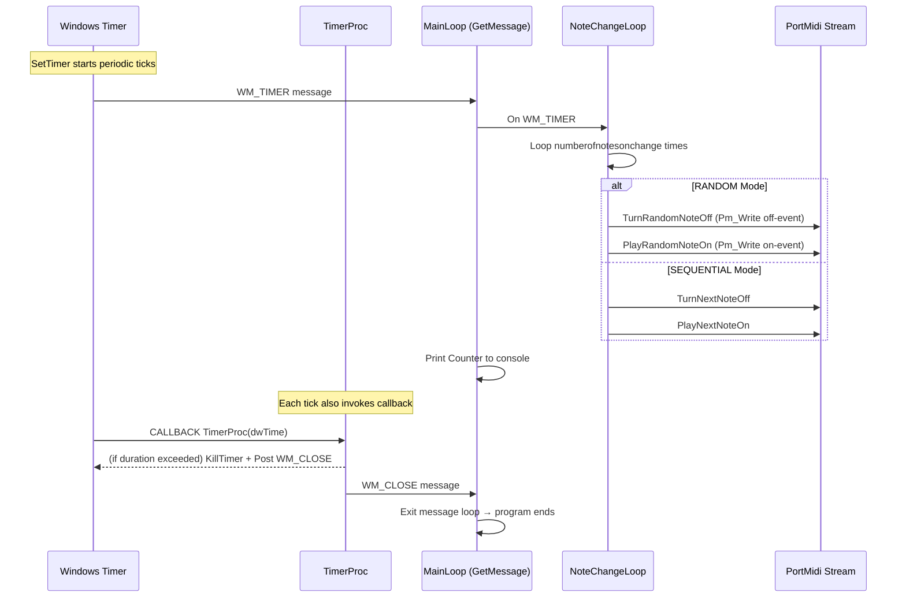

# Quick Start: Generate MIDI Minimal-Music Patterns

This section explains how the core looping mechanism drives MIDI note changes at regular intervals and how the application determines when to stop.

## How the Looping Works

When you run the minimal-music generator, it performs these high-level steps:

1. Initializes PortMidi and builds “note on” / “note off” events for the configured note set.
2. Records the start time (`global_dwStartTime_ms`).
3. Calls `SetTimer` to schedule periodic `WM_TIMER` messages based on the user’s interval setting.
4. Enters a Win32 message loop (`GetMessage`), dispatching each `WM_TIMER` to drive note changes.
5. After each tick, toggles a fixed number of notes on and off according to the selected mode (RANDOM or SEQUENTIAL), prints the tick counter, and continues until the total run duration is reached (or indefinitely if duration is negative).

---

### Timer Setup

In `main.cpp`, after preparing all MIDI events, the program computes:

- `timerelapse_ms`: the interval between ticks (in milliseconds).
- `global_loopduration_s`: total duration to run (in seconds; negative = infinite).

It then sets a Win32 timer:

```cpp
global_TimerId = SetTimer(
    NULL,
    0,
    timerelapse_ms,
    (TIMERPROC)&TimerProc
);
cout << "TimerId: " << global_TimerId << '\n';
if (!global_TimerId)
    return 16;
```

- **SetTimer** registers a system timer that sends `WM_TIMER` messages to the console window at each `timerelapse_ms` interval.
- `global_TimerId` holds the identifier; if zero, the timer failed to start.

---

### Tick Behavior (WM_TIMER Handling)

The main thread runs a standard Win32 message loop:

```cpp
while (GetMessage(&Msg, NULL, 0, 0)) 
{
    ++Counter;
    if (Msg.message == WM_TIMER)
    {
        cout << "Counter: " << Counter << "; timer message\n";

        for (int i = 0; i < numberofnotesonchange; i++)
        {
            if (global_modestring == "RANDOM")
            {
                TurnRandomNoteOff();
                PlayRandomNoteOn();
            }
            else
            {
                TurnNextNoteOff();
                PlayNextNoteOn();
            }
        }
    }
}
```

- **Counter** increments on every message (not only timers).
- On each `WM_TIMER`:
- Prints the tick count to the console.
- Repeats **numberofnotesonchange** times:
- In **RANDOM** mode:
- `TurnRandomNoteOff()` selects and turns off one currently playing note.
- `PlayRandomNoteOn()` picks and turns on a random non-playing note.
- In **SEQUENTIAL** mode:
- `TurnNextNoteOff()` turns off the next note in sequence.
- `PlayNextNoteOn()` turns on the next note in the ordered set.
- Each of these helper functions calls `Pm_Write` with a pre-built `PmEvent` to the open PortMidi stream.

---

### Stop Conditions

A separate timer callback, `TimerProc`, monitors elapsed runtime:

```cpp
VOID CALLBACK TimerProc(HWND, UINT, UINT_PTR, DWORD dwTime)
{
    float totalduration_s = (dwTime - global_dwStartTime_ms) / 1000.0f;
    if (global_loopduration_s > 0.0f 
        && totalduration_s > global_loopduration_s)
    {
        KillTimer(NULL, global_TimerId);
        global_TimerId = 0;
        // Close the console window to signal exit
        HWND hWnd = ::GetConsoleWindow();
        PostMessage(hWnd, WM_CLOSE, 0, 0);
    }
}
```

- **Elapsed time** is computed from the system tick `dwTime` minus the recorded start.
- If the configured **loop duration** is positive and exceeded:
- `KillTimer` stops further `WM_TIMER` messages.
- Posts a `WM_CLOSE` to the console window.
- The main loop then exits when it processes `WM_CLOSE`, terminating the program gracefully.

---

### Indefinite Looping

If you set the “loop duration” parameter to a negative value:

- `global_loopduration_s` ≤ 0 disables the stop-after-time check.
- `TimerProc` never calls `KillTimer` or posts `WM_CLOSE`.
- The generator continues emitting ticks (and toggling notes) until you manually terminate the console (Ctrl+C or close window).

---



With this mechanism, you get a steady stream of MIDI note-pattern changes at the interval you specify, with automatic shutdown after the desired run length (or infinite play when configured).