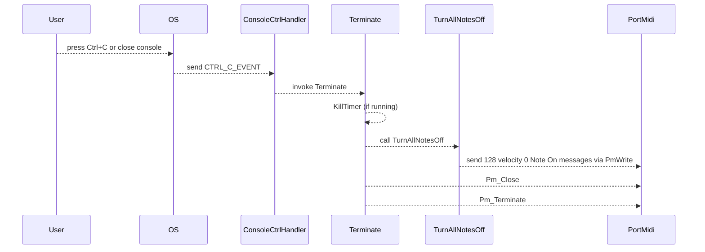

## Troubleshooting & FAQ – Stuck Notes / Hanging Sound

When the application exits—whether due to Ctrl+C/Ctrl+Break, console window close, invalid parameters on startup, or loop‐duration expiry—it invokes a “brute-force” all-notes-off routine to silence any notes that may still be sounding . This routine, **TurnAllNotesOff**, sends a velocity-zero Note On message on the configured channel for every possible MIDI note number (0–127), ensuring that even incorrectly matched or remapped notes are turned off .

### When It’s Triggered

- **Normal Exit Paths**
- End of loop when global_loopduration_s is reached
- Invalid command-line parameters detected during initialization
- User presses Ctrl+C, Ctrl+Break, or closes the console window
- **Terminate Function**
- Called by the Win32 message loop after WM_CLOSE is posted
- Called by the console control handler on termination events
- Cleans up timer, runs TurnAllNotesOff, closes and terminates PortMidi, deletes allocated PmEvent objects

### How It Works

```cpp
bool TurnAllNotesOff()
{
    // Build a single PmEvent for note-off (velocity 0) on every note
    PmEvent myPmEvent;
    myPmEvent.timestamp = 0;
    for(int midinotenumber = 0; midinotenumber < 128; midinotenumber++)
    {
        myPmEvent.message =
            Pm_Message(0x90 + global_outputmidichannel,  // Note-On status on chosen channel
                       midinotenumber,                   // MIDI note number
                       0);                               // Velocity zero = note-off
        Pm_Write(global_pPmStream, &myPmEvent, 1);     // Send it immediately
    }
    return true;
}
```

This loop guarantees that any stuck notes—whether from imperfect note-mapping, dropped Note Off messages mid-stream, or synth quirks—receive an explicit “off” command on exit .

### Sequence of Shutdown Events



### If You Still Hear Hanging Notes

- **Check Device & Channel**

Ensure that `global_outputmidichannel` matches the channel your synth or software instrument is actually listening on.

- **Synth Interpretation**

Some synths do not treat Note On velocity 0 as Note Off. Verify that your target device honors that convention, or consider sending a MIDI **All Notes Off** CC 123 instead.

- **Alternate All-Off Methods**

If notes persist, try sending:

```plaintext
  Pm_Message(0xB0 + channel, 123, 0)  // CC 123 – All Notes Off
```

- **Device-Specific Quirks**

Some virtual MIDI devices (e.g., loopback drivers, sample players) may remap or ignore certain commands. Confirm behavior in a dedicated MIDI monitor or your DAW’s MIDI logger.

- **Channel Range Configuration**

If you use `global_outputmidichannelrange` to randomize channels, make sure its value and your synth’s channel-range support align correctly.

By relying on a brute-force, velocity-zero Note On across the entire note range at shutdown, the application offers a last-resort silencing mechanism. If residual sound persists, the above checks will help pinpoint device- or synth-specific causes.